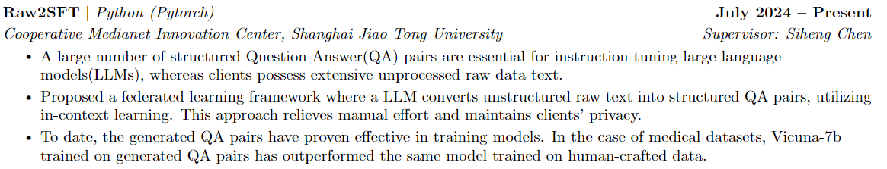

# Code Sample

Please refer to [Raw2SFT](https://github.com/VCY019/Raw2SFT).

This repo is forked from [OpenFedLLM](https://github.com/rui-ye/OpenFedLLM)

Below is a brief description of __Raw2SFT__:

# Writing Sample

Please refer to [Writing_Sample](Writing_Sample.pdf)

I only write two parts: ___line 593-597 (IFD)___ and ___Appendix A.5 Case Study___.